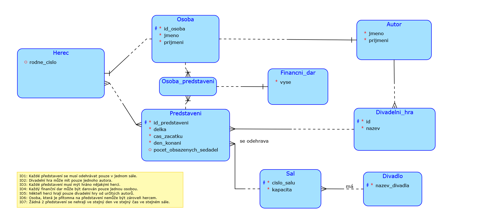

# Databáze divadla

**Divadlo pro Radost** je neziskové ochotnické divadlo v centru Prahy, což znamená, že vstup není zpoplatněný.

V divadle se každý večer koná nějaké představení, u kterého nás zajímá hlavně jeho *délka* (uvádíme v minutách), *čas začátku představení* a *den konání představení*, dále můžeme také evidovat *počet obsazených sedadel*. V jednotlivých představeních bude vždy ztvárněna nějaká **divadelní hra** , u které bude důležité znát její *název*. Ke ztvárnění jednotlivých divadelních her jsou zapotřebí **herci** , u kterých musíme znát především jejich *divadlem stanovené osobní číslo*, dále u jednotlivých herců musíme evidovat jejich *jméno* a *příjmení* a můžeme znát i jejich *rodné číslo*. Každá **divadelní hra** také musí mít svého **autora** , u kterého bude zapotřebí znát jeho *jméno* a *příjmení*. Divadlo disponuje třemi **sály** (1 malý, 2 velké). Někteří herci jsou velmi vybíravý a budou hrát pouze divadelní hry od určitého autora. Každé představení Divadla pro Radost se musí odehrávat v jednom z jeho sálů. U jednotlivých sálů bude potřeba znát jejich *číslo* a *kapacitu*. Je také nutností, že oba velké sály musí mít **vyšší kapacitu nežli sál malý**.

Jelikož je divadlo velmi často a hojně navštěvováno, musíme evidovat i informace o jednotlivých **osobách** , které jednotlivá představení navštěvují. Jak již bylo zmíněno, tak je divadlo neziskové, tudíž jednotliví herci nedostávají výplatu. Divadlo funguje pouze na principu dobrovolného **finančního daru** , u kterého, pokud se daná osoba rozhodla nějaký finanční dar divadlu poskytnout, je zapotřebí znát jeho *výši*. Přispění divadlu finančním darem není nutností a zároveň mohou finanční dar poskytnout pouze osoby. U osob navštěvujících divadlo budeme muset znát jejich *jméno* , *příjmení* a *informaci o tom, zdali darovali divadlu nějaký finanční dar* ve formě příspěvku (uvádíme pouze ANO / NE).

**If you wish to read this in english view the readmeENG.txt file**
