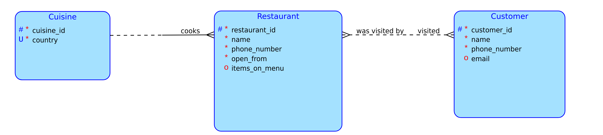

# Databáze restaurací

Aplikace zaznamenáva a sleduje kteří návštěvníci navštívili jakou restauraci se kterou kuchyní. Umožní také uživateli přidat restauraci do seznamu navštívených restaurací.

## Dotaz

Vypiš všechny zákazníky, kteří navštívili restauraci, která vaří danou kuchyň.

## Složitější operace

Aplikace zabrání zákazníkovi přidat restauraci do seznamu navštívených restaurací, pokud ještě nebyla restaurace otevřena.

